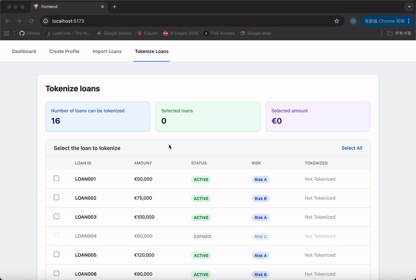

# Credit Platform - Loan Tokenization System

A full-stack web application for credit institutions to manage and tokenize loans. Built with NestJS (backend) and React + TypeScript (frontend).

## Features

- **Profile Management**: Create and manage credit institution profiles
- **Loan Import**: Upload loan data via CSV files
- **Loan Tokenization**: Convert loans into tokenized assets
- **Dashboard**: Visualize loan portfolio with interactive charts and statistics

## Tech Stack

### Backend

- NestJS (Node.js framework)
- TypeScript
- PapaParse (CSV parsing)
- Swagger (API documentation)

### Frontend

- React 19
- TypeScript
- Tailwind CSS
- Recharts (data visualization)

## Project Structure

```
├── backend/
│   ├── src/
│   │   ├── profile/       # Profile management module
│   │   ├── loan/          # Loan management module
│   │   ├── dashboard/     # Dashboard module
│   │   └── types/         # TypeScript interfaces
│   └── package.json
│
├── frontend/
│   ├── src/
│   │   ├── components/    # React components
│   │   ├── services/      # API service layer
│   │   └── App.tsx
│   └── package.json
│
└── README.md
```

## How To Start

### Prerequisites

- Node.js (v18 or higher)
- npm or yarn

### Installation

**Clone the repository**

```bash
git clone <repository-url>
cd credit-platform
```

**Install backend dependencies**

```bash
cd backend
npm install
```

**Install frontend dependencies**

```bash
cd ../frontend
npm install
```

### Running the Application

1. **Start the backend server**

```bash
cd backend
npm run start:dev
```

The backend will run on `http://localhost:3000`

1. **Start the frontend development server**

```bash
cd frontend
npm run dev
```

The frontend will run on `http://localhost:5173`

## API Documentation

Once the backend is running, access the Swagger API documentation at:

```
http://localhost:3000/api-docs
```

## API Endpoints

### Profile

- `POST /profile/create-profile` - Create a new credit institution profile
- `GET /profile` - Get all profiles
- `GET /profile/:id` - Get profile by ID

### Loan

- `POST /loan/upload-csv` - Upload CSV file with loan data
- `GET /loan/all-loans` - Get all loans
- `POST /loan/tokenize-loans` - Tokenize selected loans

### Dashboard

- `GET /dashboard` - Get dashboard summary data

## CSV File Format

When importing loans, your CSV file should include the following columns:

csv

```csv
loan_id,status,amount,payment_schedule,interest_rate,ltv,risk_group,agreement_url
LOAN001,ACTIVE,50000,monthly,3.5,80,A,https://example.com/agreement1
LOAN002,ACTIVE,75000,quarterly,4.2,75,B,https://example.com/agreement2
```

### Required Fields:

- `loan_id` - Unique loan identifier
- `status` - Loan status (ACTIVE or EXPIRED)
- `amount` - Loan amount in EUR
- `payment_schedule` - Payment frequency
- `interest_rate` - Interest rate percentage
- `ltv` - Loan-to-value ratio (optional)
- `risk_group` - Risk classification
- `agreement_url` - URL to loan agreement

### Sample CSV File

A sample CSV file is included in the repository at `sample-loans.csv` for testing purposes.

## Data Storage

**Note**: This application uses **in-memory storage** for demonstration purposes. All data will be lost when the server restarts. This is intentional for the demo/interview task scope.

## DEMO

### Import loans


### Tokenize loans



### Dashboard


### Create profile

